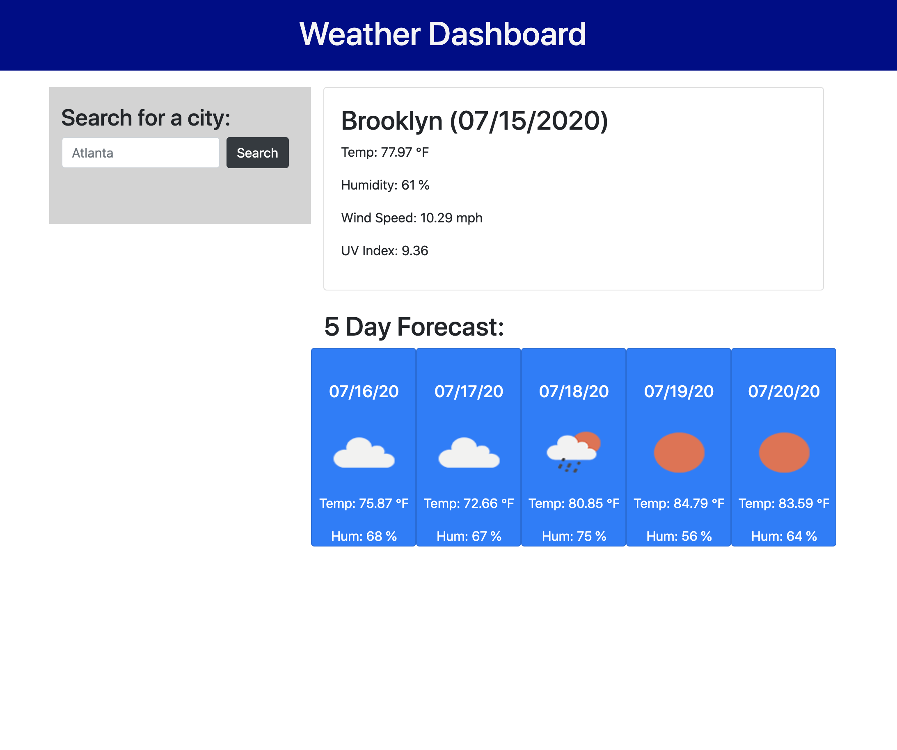
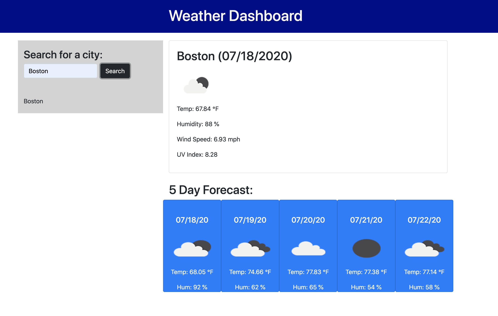

# Weather Forecast Application

## What I did
* I added a search bar to look for the data on any given city.
    * When the user searches for a city, then the city is saved in local storage and displayed in a list of previous queries.
* Then I added an area for the current weather data of the city.
* And then for the same city, I added a separate 5-day forecast for the rest of the week.

## Comments
I'm still working on how to make my code more organized and streamlined.  Right now, my local storage is abit weird.  When I refresh, it doesn't stay on the page, but it does in the console.  I'll make sure to ask my tutor about that.

## Link to dashboard
https://jonayahj.github.io/HW6/

## Screenshot of dashboard
First take

Second take
